# Student Dropout Prediction Project Report Draft

## 1. Introduction

本项目基于 Student Dropout Dataset，目标是预测学生最终状态：`Dropout`、`Enrolled` 或 `Graduate`。数据集包含 4424 条学生记录、36 个输入特征和 1 个目标变量。特征覆盖入学背景、人口统计信息、家庭社会经济因素、第一和第二学期学业表现，以及宏观经济变量。

项目按课程要求完成了数据预处理、t-SNE 可视化、聚类分析、监督学习训练与测试、模型评估与选择，并进一步进行了开放式探索。整体结论是：数据中确实存在可学习的学业风险信号，但三分类任务并不容易，主要困难来自 `Enrolled` 这一过渡状态与 `Graduate`、`Dropout` 的特征重叠。最终监督模型能达到约 0.70 左右的 test macro-F1 和约 0.88-0.89 的 macro AUC，说明模型有稳定预测能力；但 `Enrolled` 的分类表现仍然是主要瓶颈。

## 2. Data Preprocessing

原始数据共有 4424 行、37 列，其中 36 个输入特征和 1 个目标列 `Target`。目标类别分布如下：

| Class | Count | Percentage |
|---|---:|---:|
| Graduate | 2209 | 49.9% |
| Dropout | 1421 | 32.1% |
| Enrolled | 794 | 17.9% |

数据本身没有缺失值和重复行，但存在中等程度类别不平衡，尤其 `Enrolled` 是少数类。因此后续模型评估不只看 accuracy，而重点使用 macro-averaged precision、recall、F1 和 AUC。

预处理的核心思路是避免把所有数字列都当作连续变量。虽然原始 CSV 中所有特征都能被 pandas 读成数值型，但许多字段本质是整数编码的类别变量，例如 `Course`、`Application mode`、父母职业和学历等。如果直接标准化这些类别 ID，会引入没有业务意义的大小关系和距离。因此我们按语义将特征分为三类：

| Feature Type | Processing |
|---|---|
| Numeric/count features | median imputation + `StandardScaler` |
| Nominal categorical features | most-frequent imputation + `OneHotEncoder(drop='first', handle_unknown='ignore')` |
| Binary features | passthrough |

最终还进行了特征过滤和特征工程。近零方差特征如 `Nacionality`、`Educational special needs`、`International` 被移除；高度冗余的部分学期行政计数字段也被删除，以降低噪声和稀疏维度。与此同时，保留了关键学业进展变量，因为它们直接反映学生学习过程。

我们新增了三个学业轨迹特征：

| New Feature | Formula | Interpretation |
|---|---|---|
| `approval_rate_1st` | 1st semester approved / (1st semester evaluations + 1) | First-semester success rate |
| `approval_rate_2nd` | 2nd semester approved / (2nd semester evaluations + 1) | Second-semester success rate |
| `grade_trend` | 2nd semester grade - 1st semester grade | Academic improvement or decline |

经过过滤和特征工程后，原始输入特征变为 33 个；经过 one-hot encoding 和标准化后，最终特征矩阵为 `(4424, 172)`。整个预处理过程放入 `Pipeline` 和 `ColumnTransformer` 中，保证训练集、测试集和交叉验证中的处理一致，避免数据泄漏。

关键预处理图：

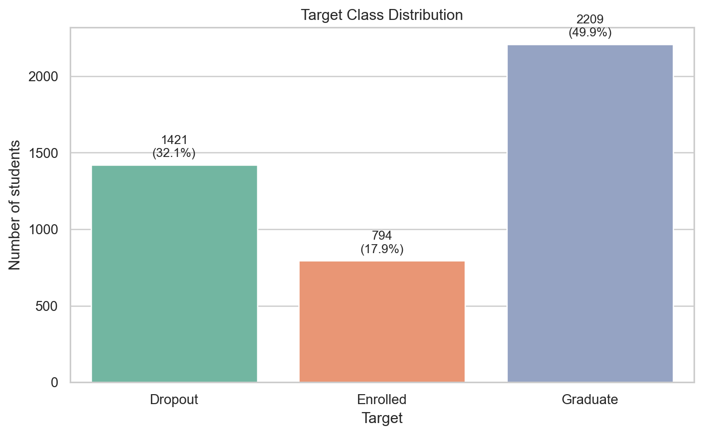

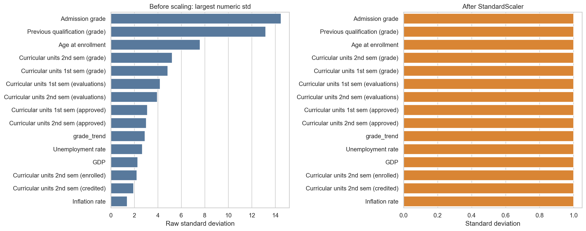

## 3. t-SNE Visualization

为了观察高维特征空间中三类学生状态的结构，我们先将 172 维预处理特征用 PCA 降到 50 维，再进行 t-SNE 二维可视化。PCA 的累计解释方差约为 0.9744，说明 50 个主成分保留了绝大多数预处理特征信息。t-SNE 使用 `perplexity=30`、`init='pca'`、`learning_rate='auto'` 和固定随机种子。

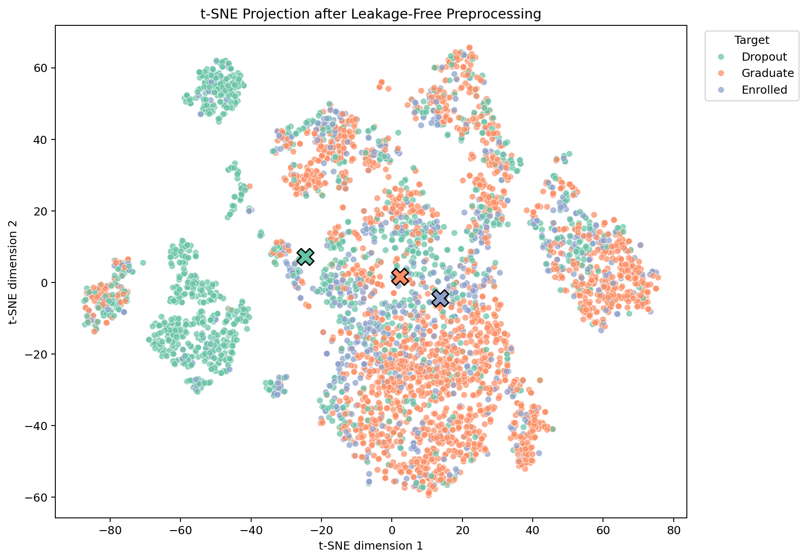

t-SNE 结果显示三类不是干净分离的三个簇。类别中心距离显示，`Enrolled` 与 `Graduate` 的中心距离最小，约为 11.88；`Dropout` 与 `Graduate` 的距离最大，约为 39.15。这说明目前仍在读的学生在特征上更接近最终毕业学生，而不是完全独立的一类。

我们还进行了 perplexity sensitivity analysis，比较了 `perplexity=10, 30, 50`。虽然具体几何形状会变化，但主要结论稳定：三类存在明显重叠，尤其 `Enrolled` 与其他类别之间边界不清晰。

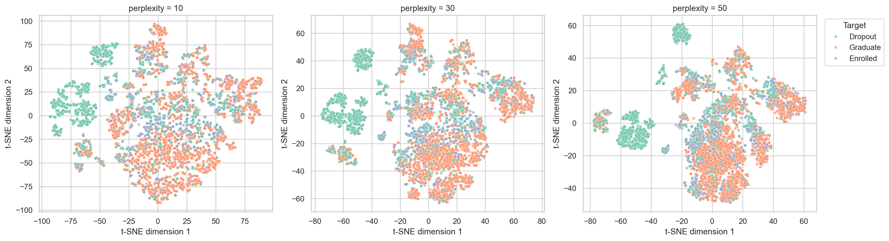

因此，t-SNE 支持一个重要判断：当前任务不是简单的线性或聚类可分问题，后续模型需要通过监督学习利用弱结构信号，而不能期待无监督方法直接恢复三类标签。

## 4. Clustering Analysis

聚类部分的目标是检验真实标签是否对应自然聚类结构。我们没有只使用两个算法，而是在 PCA 50 维表示上比较了七类聚类方法：

| Algorithm | Role |
|---|---|
| KMeans | centroid-based baseline |
| MiniBatchKMeans | scalable KMeans variant |
| Agglomerative Ward | hierarchical clustering |
| BIRCH | tree-based scalable clustering |
| Spectral Clustering | graph-based clustering |
| Gaussian Mixture | probabilistic clustering |
| DBSCAN | density-based clustering |

对于需要指定簇数的方法，我们扫描 `k=2` 到 `k=8`；对于 DBSCAN，我们扫描多个 `eps` 和 `min_samples`。评价指标分为内部指标和外部参考指标：内部指标包括 Silhouette、Calinski-Harabasz、Davies-Bouldin；外部参考指标包括 ARI、NMI、homogeneity、completeness 和 V-measure。真实标签只用于事后解释，不参与聚类训练。

主要结果如下：

| Setting | Silhouette | ARI | NMI | Interpretation |
|---|---:|---:|---:|---|
| KMeans, k=2 | 0.2774 | 0.1966 | 0.2027 | Best internal structure |
| MiniBatchKMeans, k=2 | 0.2776 | 0.1973 | 0.2025 | Similar to KMeans k=2 |
| KMeans, k=3 | 0.2774 | 0.1750 | 0.1787 | Best internal k=3 option |

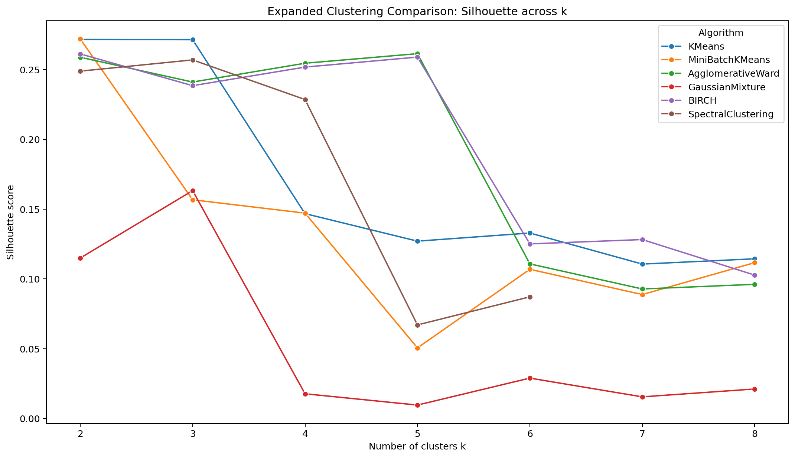

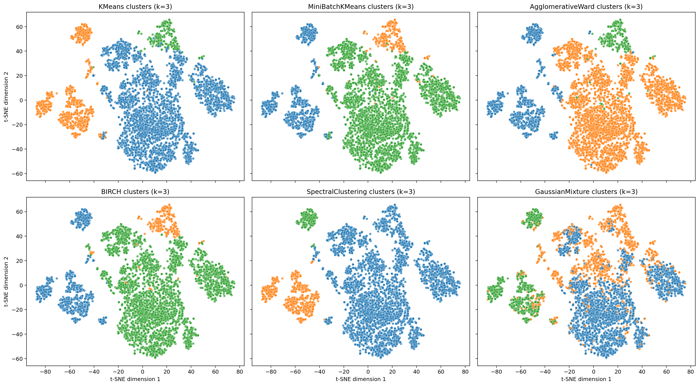

聚类结论是：数据最强的自然结构更接近 `k=2`，可以解释为较粗粒度的 `At-Risk` vs `Graduate` 模式。强行使用 `k=3` 可以作为对三分类标签的诊断，但 ARI 和 NMI 都不高，说明 `Dropout`、`Enrolled` 和 `Graduate` 并不是三个天然清晰分离的簇。DBSCAN 表现不稳定，也说明数据不具备清晰密度分离结构。

这个负结果本身有价值：它说明监督学习是必要的，而中等水平的三分类表现并不是单一模型失败造成的。

## 5. Supervised Learning: Training and Testing

监督学习部分首先满足课程要求，选择 `Target` 作为三分类目标，并使用 70/30 stratified train-test split。训练集 3096 条，测试集 1328 条，类别比例与全数据保持一致。

必做的简单模型包括：

- `LogisticRegression_balanced`
- `DecisionTree_default`

为了提高分析深度，我们进一步比较了七个扩展模型：

- `RandomForest_balanced`
- `ExtraTrees_balanced`
- `GradientBoosting`
- `HistGradientBoosting_balanced`
- `LinearSVM_balanced`
- `RBF_SVM_balanced`
- `MLP`

所有模型都放在 `Pipeline(preprocessor, model)` 中训练，保证预处理只在训练数据上拟合，并在交叉验证中保持无泄漏。

Task 4 的主要结果如下：

| Model | CV F1 Macro | Test F1 Macro |
|---|---:|---:|
| GradientBoosting | 0.7010 | 0.7067 |
| RBF_SVM_balanced | 0.7127 | 0.7054 |
| LogisticRegression_balanced | 0.7082 | 0.7000 |
| LinearSVM_balanced | 0.7029 | 0.6963 |
| ExtraTrees_balanced | 0.6961 | 0.6953 |
| RandomForest_balanced | 0.6831 | 0.6909 |
| HistGradientBoosting_balanced | 0.7134 | 0.6853 |
| MLP | 0.6524 | 0.6706 |
| DecisionTree_default | 0.6272 | 0.6280 |

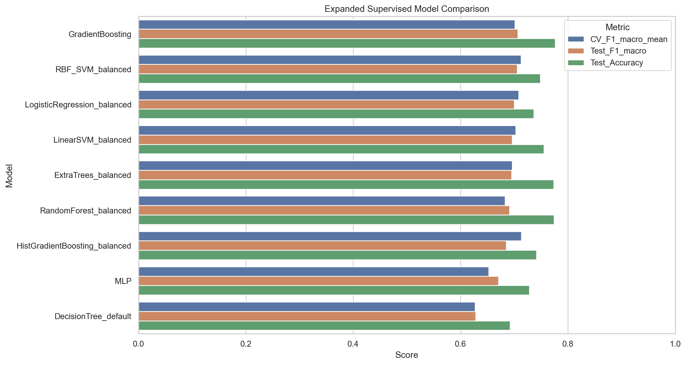

Logistic Regression 作为简单线性基线表现稳定，test macro-F1 约 0.7000；默认 Decision Tree 在训练集上接近完美，但测试集 macro-F1 只有 0.6280，明显过拟合。扩展模型中 Gradient Boosting、RBF SVM 和 Logistic Regression 的测试表现较强，但不同模型之间差距并不巨大。这说明任务难度主要来自数据结构和类别重叠，而不是某一个模型族明显不足。

## 6. Model Evaluation and Final Model Selection

Task 5 对九个模型族进行了更系统的 GridSearchCV 调参。模型选择规则是：只根据训练集内部 5-fold cross-validation 的 `f1_macro` 选择最终模型；测试集只用于选择后的最终诊断，避免 test-set selection leakage。

最新结果中，最终按验证集 macro-F1 选择的模型是 `ExtraTrees_tuned`：

| Model | Best CV F1 Macro | Test F1 Macro | Test AUC Macro OVR | Train-Test F1 Gap |
|---|---:|---:|---:|---:|
| ExtraTrees_tuned | 0.7195 | 0.7031 | 0.8859 | 0.2015 |
| HistGradientBoosting_tuned | 0.7158 | 0.7064 | 0.8908 | 0.1112 |
| RandomForest_tuned | 0.7109 | 0.7159 | 0.8879 | 0.1402 |
| LinearSVM_tuned | 0.7108 | 0.7042 | 0.8756 | 0.0361 |
| RBF_SVM_tuned | 0.7103 | 0.7037 | 0.8674 | 0.1525 |

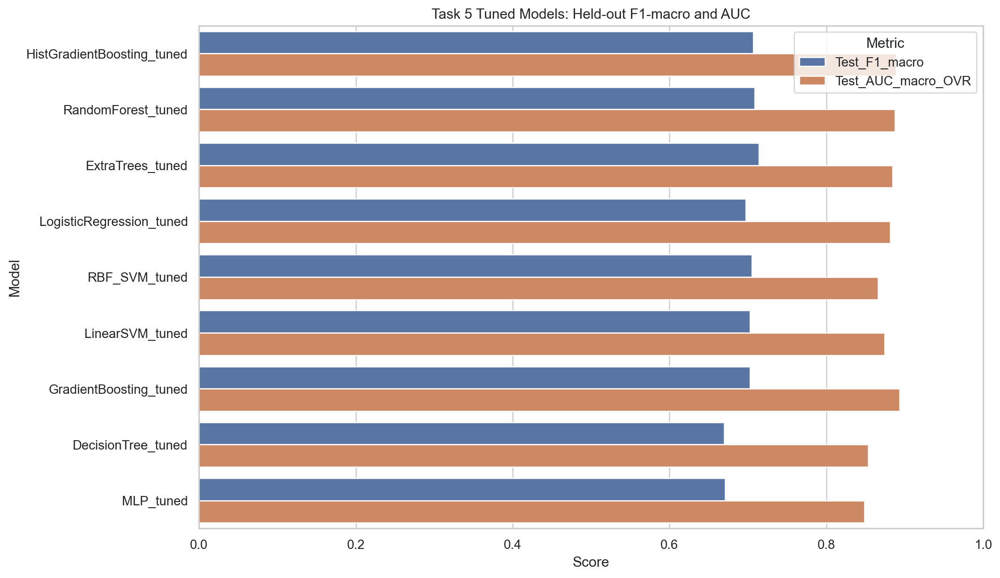

需要注意的是，`RandomForest_tuned` 的 held-out test F1 最高，约为 0.7159；`HistGradientBoosting_tuned` 的 test F1 和 AUC 也很强，并且 train-test gap 更小。但是我们不能用测试集表现反过来选择最终模型，因此最终模型仍然是 cross-validation 表现最好的 `ExtraTrees_tuned`。这种选择方式比直接挑测试集最高分更严谨。

从类别表现看，三分类瓶颈仍然集中在 `Enrolled`。例如 `ExtraTrees_tuned` 的 `Enrolled` F1 约为 0.515，而 `Dropout` 和 `Graduate` 的 F1 明显更高。这与 t-SNE 和聚类结果一致：`Enrolled` 是过渡状态，特征上同时接近其他两类，因此最难区分。

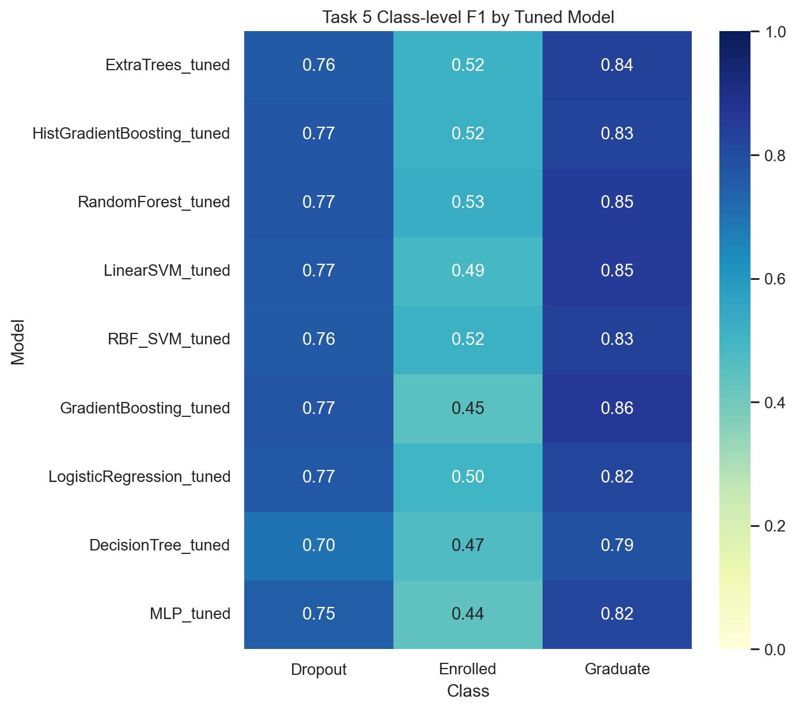

最终模型的 permutation importance 显示，最重要的变量主要是学业进展和缴费状态：

| Feature | Importance Mean |
|---|---:|
| `approval_rate_2nd` | 0.1040 |
| `Tuition fees up to date` | 0.0584 |
| `approval_rate_1st` | 0.0212 |
| `Curricular units 2nd sem (grade)` | 0.0130 |
| `Course` | 0.0097 |
| `Curricular units 2nd sem (approved)` | 0.0089 |

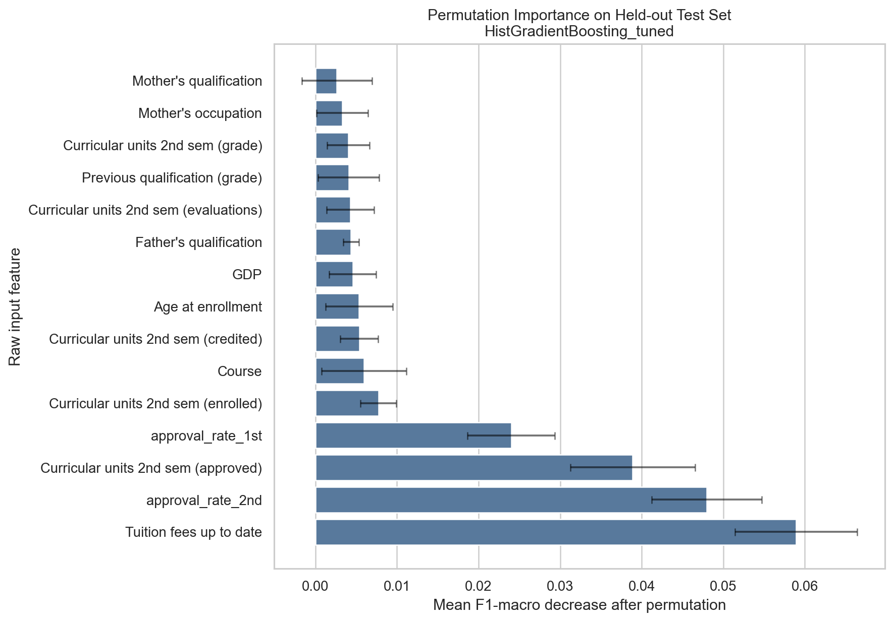

这些特征非常符合业务直觉：第二学期通过率、缴费状态、第一学期通过率和学期成绩都是学生是否退学、仍在读或毕业的重要信号。这说明模型学到的是可解释且合理的模式，而不是随机噪声。

## 7. Open-ended Exploration: Similar-Class Joint Analysis

开放式探索部分针对前面所有任务中反复出现的问题：`Enrolled` 与其他类高度重叠。我们将问题重新组织为两阶段风险分析：

1. 将 `Dropout` 和 `Enrolled` 合并为 `At-Risk`，训练 `At-Risk` vs `Graduate` 二分类模型。
2. 在 `At-Risk` 子集中进一步训练 `Dropout` vs `Enrolled` 二分类模型。
3. 将 Task 5 最终三分类模型的预测折叠成 `At-Risk` vs `Graduate`，与专门二分类模型比较。

### 7.1 At-Risk Detection

At-Risk 检测结果如下：

| Model | Best CV F1 Macro | Test F1 Macro | At-Risk Precision | At-Risk Recall | Test AUC |
|---|---:|---:|---:|---:|---:|
| ExtraTrees_tuned collapsed | - | 0.8381 | 0.8299 | 0.8511 | 0.9295 |
| Group_LogisticRegression_tuned | 0.8581 | 0.8319 | 0.8542 | 0.8015 | 0.9099 |
| Group_HistGradientBoosting_tuned | 0.8612 | 0.8386 | 0.8667 | 0.8015 | 0.9142 |
| Group_RandomForest_tuned | 0.8505 | 0.8287 | 0.8650 | 0.7805 | 0.9079 |

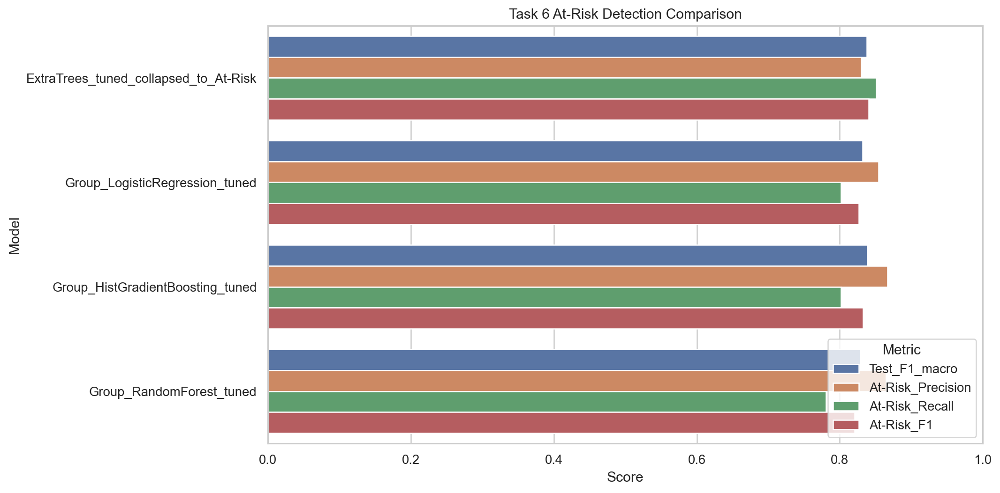

专门的 `Group_HistGradientBoosting_tuned` 在 CV F1 上最高，但 collapsed Task 5 模型的 At-Risk recall 更高。这说明二分类模型不是简单全面替代三分类模型，而是在 precision 和 recall 之间提供不同业务取舍。如果学校希望尽量发现所有潜在风险学生，collapsed 三分类模型的 recall 更有价值；如果希望减少误报，专门二分类模型的 precision 更好。

### 7.2 Dropout vs Enrolled Subgroup

在 At-Risk 子集中，进一步区分 `Dropout` 和 `Enrolled` 的结果如下：

| Model | Best CV F1 Macro | Test F1 Macro | Enrolled Precision | Enrolled Recall | Enrolled F1 | Test AUC |
|---|---:|---:|---:|---:|---:|---:|
| Subgroup_HistGradientBoosting_tuned | 0.7727 | 0.7654 | 0.6344 | 0.8529 | 0.7276 | 0.8366 |
| Subgroup_RandomForest_tuned | 0.7726 | 0.7610 | 0.6355 | 0.8277 | 0.7190 | 0.8293 |
| Subgroup_RBF_SVM_tuned | 0.7696 | 0.7403 | 0.6216 | 0.7731 | 0.6891 | 0.8308 |
| Subgroup_LogisticRegression_tuned | 0.7685 | 0.7529 | 0.6287 | 0.8109 | 0.7083 | 0.8426 |

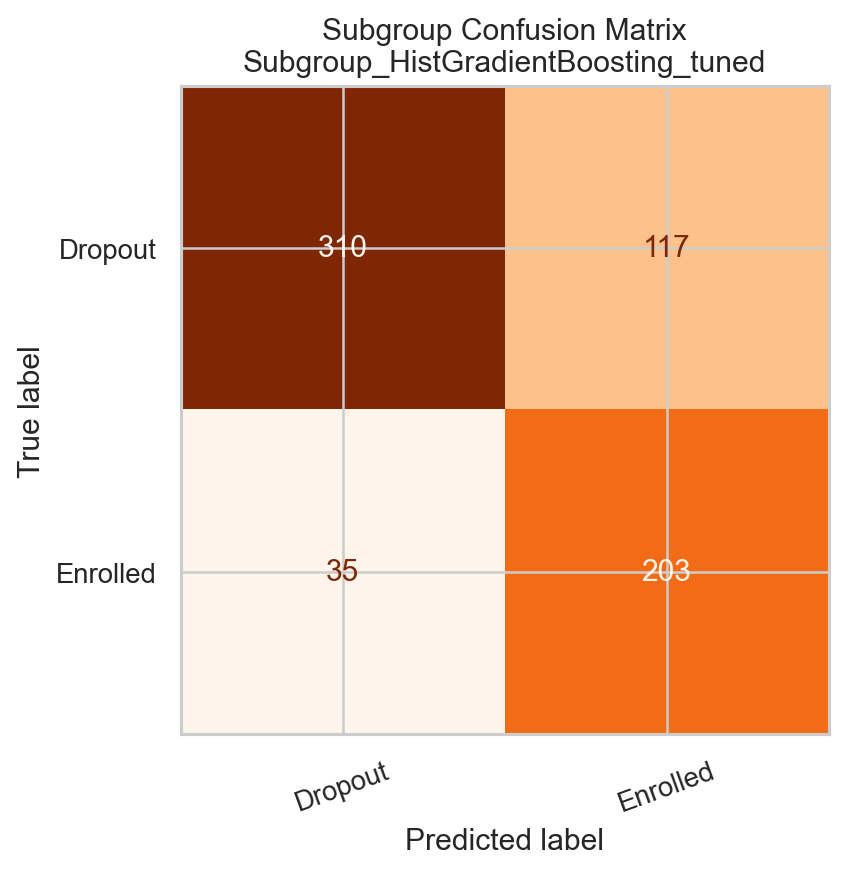

两阶段子任务显著改善了 `Enrolled` 的识别解释：在三分类中 `Enrolled` F1 约为 0.51-0.53，而在 `Dropout` vs `Enrolled` 子任务中，最佳模型的 `Enrolled` F1 达到约 0.728。这说明原始三分类的主要困难确实来自三类同时竞争时的边界重叠，而不是 `Enrolled` 完全不可预测。

### 7.3 Similarity Evidence

t-SNE 中心距离进一步支持这一解释：

| Pair | Distance |
|---|---:|
| Enrolled-Graduate | 11.80 |
| Dropout-Enrolled | 28.02 |
| Dropout-Graduate | 39.13 |

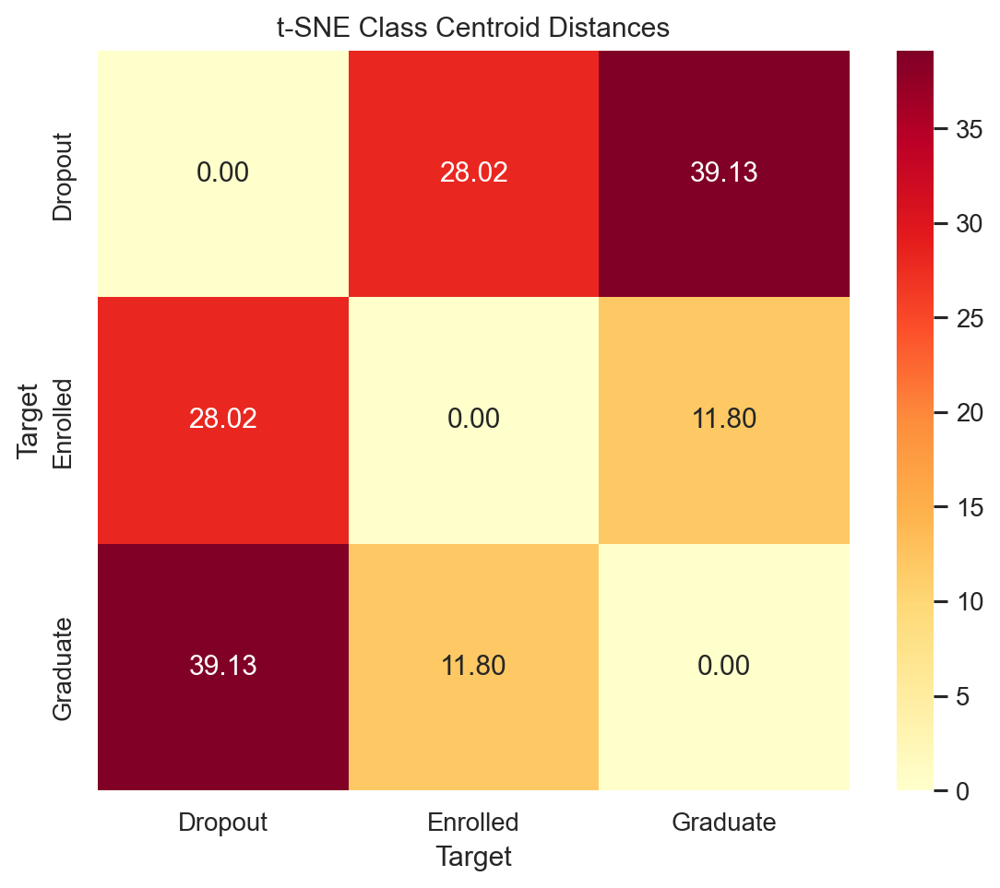

`Enrolled` 与 `Graduate` 的距离最近，因此 `At-Risk = Dropout + Enrolled` 并不是自然聚类意义上的最接近组合，而是一个实践中的干预分组。这个结果让 Task 6 的结论更严谨：二阶段模型是一个业务视角的风险分析，而不是声称数据天然存在 `At-Risk` 簇。

## 8. Discussion

综合所有任务，当前结果是合理且一致的。预处理没有明显问题，模型也不是简单欠拟合。相反，多条证据都指向同一个解释：学生最终状态之间存在真实的特征重叠，尤其 `Enrolled` 是过渡状态，既可能接近未来毕业学生，也可能接近未来退学学生。

证据链如下：

1. t-SNE 显示三类不形成清晰分离，`Enrolled` 与 `Graduate` 最近。
2. 聚类结果显示最强自然结构更接近 `k=2`，而不是目标标签的三类。
3. 多个监督模型调参后 macro-F1 都集中在约 0.70-0.72，没有某一个模型能大幅突破。
4. 类别级 F1 显示主要困难集中在 `Enrolled`，而不是所有类别都表现差。
5. Task 6 二阶段分析能提升子任务中的 `Enrolled` 识别，但同时显示 At-Risk 检测存在 precision-recall trade-off。
6. Permutation importance 的核心特征与学业进展和缴费状态一致，模型解释符合业务逻辑。

因此，当前 moderate macro-F1 不应被解释为预处理失败，而应解释为数据可分性有限和过渡类别本身难以定义。项目在课程范围内已经进行了较充分的无监督与监督对比，但不声称穷尽所有可能方法。

## 9. Conclusion

本项目构建了一个可复现、无泄漏、可解释的学生状态预测流程。最终预处理矩阵包含 172 个特征，监督学习部分比较了线性模型、树模型、集成模型、SVM 和神经网络，并通过 5-fold validation 选择最终模型。最新结果中，`ExtraTrees_tuned` 以最高 cross-validated macro-F1 被选为最终三分类模型，test macro-F1 为 0.7031，macro AUC 为 0.8859。

项目最重要的发现不是某个模型单独胜出，而是数据结构本身的规律：学业进展和缴费状态是最重要预测信号；`Dropout` 和 `Graduate` 相对更容易区分；`Enrolled` 是核心难点，因为它在特征空间中与其他类别高度重叠。Task 6 的二阶段分析进一步说明，在业务干预场景中，可以将三分类预测与 At-Risk 检测结合使用，根据目标选择更高 recall 或更高 precision 的方案。

未来改进可以考虑 nested cross-validation、系统性 threshold tuning、probability calibration、cost-sensitive learning、SMOTE 或其他 resampling 方法，以及 XGBoost、LightGBM、CatBoost 等专门面向 tabular data 的 boosting 模型。但在 DSAA2011 课程项目范围内，目前的实验设计、模型比较和解释链条已经较完整，能够支撑一个高质量的项目报告。

